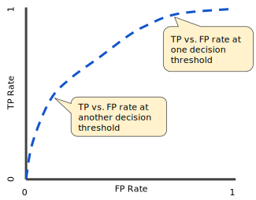

# Udacity Machine Learning Engineer Nanodegree
# Melanoma Classification - Project Report

Pritesh Shrivastava
July 17th, 2020

## Definition

### Project Overview
	
Skin cancer is the most prevalent type of cancer. Melanoma, specifically, is responsible for 75% of skin cancer deaths, despite being the least common skin cancer. The American Cancer Society estimates over 100,000 new melanoma cases will be diagnosed in 2020. It's also expected that almost 7,000 people will die from the disease. As with other cancers, early and accurate detection—potentially aided by data science—can make treatment more effective.

Currently, dermatologists evaluate every one of a patient's moles to identify outlier lesions or “ugly ducklings” that are most likely to be melanoma. Existing AI approaches have not adequately considered this clinical frame of reference. Dermatologists could enhance their diagnostic accuracy if detection algorithms take into account “contextual” images within the same patient to determine which images represent a melanoma. If successful, classifiers would be more accurate and could better support dermatological clinic work.

As the leading healthcare organization for informatics in medical imaging, the [Society for Imaging Informatics in Medicine (SIIM)](https://siim.org/)'s mission is to advance medical imaging informatics through education, research, and innovation in a multi-disciplinary community. SIIM is joined by the [International Skin Imaging Collaboration (ISIC)](https://www.isic-archive.com/#!/topWithHeader/wideContentTop/main), an international effort to improve melanoma diagnosis. The ISIC Archive contains the largest publicly available collection of quality-controlled dermoscopic images of skin lesions. This dataset has been relesed on the competitive data science platform [Kaggle](https://www.kaggle.com/c/siim-isic-melanoma-classification/data)

[Source](https://www.kaggle.com/c/siim-isic-melanoma-classification/overview)

### Problem Statement
	
In this competition, participants will identify melanoma in images of skin lesions. In particular, they will use images within the same patient and determine which are likely to represent a melanoma. Specifically, participants need to predict a binary target for each image ie, the probability (floating point) between 0.0 and 1.0 that the lesion in the image is malignant (the target).

For this competition, we are going to build an image classifier using deep learning. We will need to begin with image pre-processing as we have images of varying sizes, for eg., 1024x1024x3 vs 512x512x3 etc.
We can combine the results of the image classifier with a tabular data classifier on image metadata for ensembling.

For working with tfrecords, Tensorflow library will be a good choice to build our neural network. 
We can use stratified k-folds for model validation before making predictions on the test set.
Since training a deep learning model on a large image dataset (~120 GB) is going to be a compute heavy task,
Kaggle notebooks which offer free GPUs (and TPUs) can serve as the ideal solution for training this model.
Additionally, pretrained models such as ImageNet might be explored to get a good score.

### Metrics
	
Evaluation metric for this Kaggle competition is Area under the ROC curve. This value is calculated on the test set. As the competition is currently open, its public leaderboard is calculated with approximately 30% of the test data. The final results will be based on the other 70 % of test data. 
We will try to optimize our AUROC value on the public leaderboard for this capstone project.

An ROC curve (receiver operating characteristic curve) is a graph showing the performance of a classification model at all classification thresholds. This curve plots two parameters:
- True Positive Rate (TPR), or Recall, is defined as follows : 
```
TPR = TP / (TP + FN)
```
where TP = True Positives & FN = False Negtives

- False Positive Rate (FPR) is defined as follows :
```
FPR = FP / (FP + TN)
```
where, FP = False Positives & TN = True Negatives

An ROC curve plots TPR vs. FPR at different classification thresholds. Lowering the classification threshold classifies more items as positive, thus increasing both False Positives and True Positives.



Source: https://developers.google.com/machine-learning/crash-course/classification/roc-and-auc

AUC is desirable for the following two reasons:

* AUC is scale-invariant. It measures how well predictions are ranked, rather than their absolute values.
* AUC is classification-threshold-invariant. It measures the quality of the model's predictions irrespective of what classification threshold is chosen.


## Analysis

### Data Exploration
	
The dataset consists of images in :

    DICOM format
    JPEG format in JPEG directory
    TFRecord format in tfrecords directory

Additionally, there is a metadata comprising of train, test and submission file in CSV format. 

#### File Sizes

Total size of the dataset (Images + Files) - 108.19 GB

The sizes of the CSV files are shown below : 
* train.csv - 1.96 MB - (33126 records, 8 columns)
* test.csv - 479 KB - (10982 records, 5 columns)
* sample_submission.csv - 161 KB (10982 records, 2 columns)

#### Column description

The description for columns in these 3 files are :

* image_name - unique identifier, points to filename of related DICOM image
* patient_id - unique patient identifier
* sex - the sex of the patient (when unknown, will be blank)
* age_approx - approximate patient age at time of imaging
* anatom_site_general_challenge - location of imaged site
* diagnosis - detailed diagnosis information (train only)
* benign_malignant - indicator of malignancy of imaged lesion
* target - binarized version of the target variable, the value 0 denotes `benign`, and 1 indicates `malignant`


#### Sample values from train & test sets

The first 5 records from the 2 CSV files are shown below :
- Train CSV :


- Test CSV :


#### Missing Values

Null value count for both test & train datasets is shown below :


#### Imputing missing values


#### Summary statistics of metadata


### Exploratory Visualization
	

A visualization has been provided that summarizes or extracts a relevant characteristic or feature about the dataset or input data with thorough discussion. Visual cues are clearly defined.

### Algorithms and Techniques
	
For image classification, we are going to use transfer learning. We will use a pre-trained model (VGG16) and modify the output layer using our data. Transfer learning will be helpful in this case because the pre-trained model will already have some kind of intelligence on real world objects built into it which will help with classifying our skin cancer related images as well.

The VGG network is described below :

#### VGG Net - Introduction

The full name of VGG is the Visual Geometry Group, which belongs to the Department of Science and Engineering of Oxford University. It has released a series of convolutional network models beginning with VGG, which can be applied to face recognition and image classification, from VGG16 to VGG19. The original purpose of VGG's research on the depth of convolutional networks is to understand how the depth of convolutional networks affects the accuracy and accuracy of large-scale image classification and recognition. -Deep-16 CNN), in order to deepen the number of network layers and to avoid too many parameters, a small 3x3 convolution kernel is used in all layers.


#### Network architecture

The input of VGG is set to an RGB image of 224x244 size. The average RGB value is calculated for all images on the training set image, and then the image is input as an input to the VGG convolution network. A 3x3 or 1x1 filter is used, and the convolution step is fixed. . There are 3 VGG fully connected layers, which can vary from VGG11 to VGG19 according to the total number of convolutional layers + fully connected layers. The minimum VGG11 has 8 convolutional layers and 3 fully connected layers. The maximum VGG19 has 16 convolutional layers. +3 fully connected layers. In addition, the VGG network is not followed by a pooling layer behind each convolutional layer, or a total of 5 pooling layers distributed under different convolutional layers. The following figure is VGG Structure diagram:


Source : https://neurohive.io/en/popular-networks/vgg16/

#### VGG16

VGG16 contains 16 layers and VGG19 contains 19 layers. A series of VGGs are exactly the same in the last three fully connected layers. The overall structure includes 5 sets of convolutional layers, followed by a MaxPool. The difference is that more and more cascaded convolutional layers are included in the five sets of convolutional layers.


Source : http://ethereon.github.io/netscope/#/preset/vgg-16

Algorithms and techniques used in the project are thoroughly discussed and properly justified based on the characteristics of the problem.

### Benchmark

A good baseline model can be created by using 3 features, namely, age, sex and the location of the images site.
We can calculate the grouped mean value for each combination of these features in the train set and 
use that to make predictions on the test set. 

Predictions using this simple mean value of the target variable gives an Area under ROC value of `0.699` on the test set (public leaderboard) !! 

Our final classifier should be able to beat atleast this benchmark to be deemed useful.

The code for the baseline model is added in the notebook `melanoma-simple-baseline.ipynb`. 

## Methodology

### Data Preprocessing 

#### Pre-processing for Image Data

* Under Sampling - Given the biased nature of training data (32542 benign records vs 584 malignant records), we are going to undersample our training set by picking random 2000 record from the benign cases, and all records from the malignant cases.

* Reshaping images - Since the images in our dataset have various sizes, we are going to reshape them all to one size (224x224)

* Train Validation Split - We will create a hold out validation set (20% of train data) to test our model performance before using it on the test set.

* Data Augmentation - We will augment our training data (after exluding the validation data) using basic augmentation techniques like rotation, flipping, shifting height & width, etc.

Code for these pre-processing steps for images is available in the notebook, `melanoma-keras-vgg.ipynb`.

#### Pre-processing for Tabular Data

* ...


### Implementation
	

The process for which metrics, algorithms, and techniques were implemented with the given datasets or input data has been thoroughly documented. Complications that occurred during the coding process are discussed.

### Refinement
	
We began with a simple baseline model that used grouped means to calculate target values. This gave us a score of 69.9% AUROC (public leaderboard).

Before trying an image classifier, we used only the tabular data with an XGBoost model to get an improved result of 72.88 %.

Next, we built an image classifier using transfer learning, with VGG-16 pretrained model, to get a much better result of AUROC 81.16 %.

We further tried to improve this result by creating an ensemble of both tablular data (XGBoost) & image data predictions to end up with a result of AUROC 82.39 %.


## Results

### Model Evaluation and Validation
	
#### Validation set results for Image Classifier

...


The final model’s qualities—such as parameters—are evaluated in detail. Some type of analysis is used to validate the robustness of the model’s solution.

### Justification
	
Our ensemble model acheives an Area under ROC curve of 82.39 % on the test set (public leaderboard). This is much better than the results of our simple baseline model that gave a score of 69.9 %. We have been able to make significant improvement over our evaluation metric through this project !

### Future steps for improvement

Use of external data, such as similar image classification competitions from previous years ([ISIC 2018](https://www.kaggle.com/shonenkov/isic2018), [ISIC 2017](https://www.kaggle.com/shonenkov/isic2017), [ISIC 2016](https://www.kaggle.com/shonenkov/isic2016)) can be explored.

Features related to the colour of the images can be included in the tabular data classifier to check if it is significant. While we have included the image dimensions as a feature in the tabular data classifier, it only serves as a target leak and is not useful for real world applications, and thus it can be dropped.

More data augmentation techniques can be tried, inlcluding training on images with differnt sizes, removing colours (converting to grayscale) and using different cropping / rotating methods.